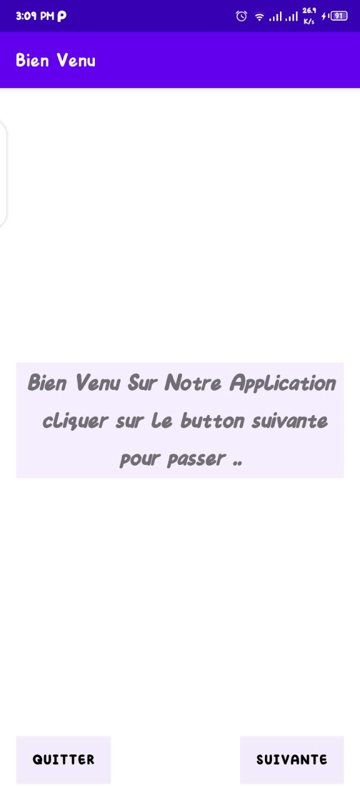
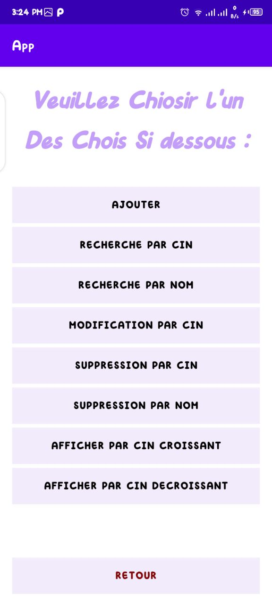
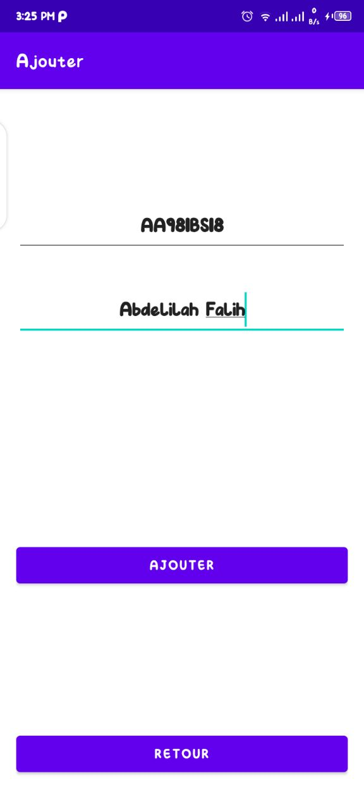
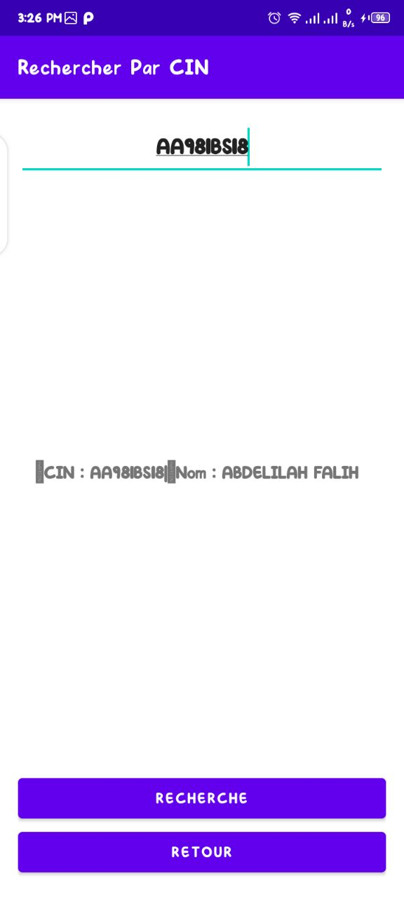
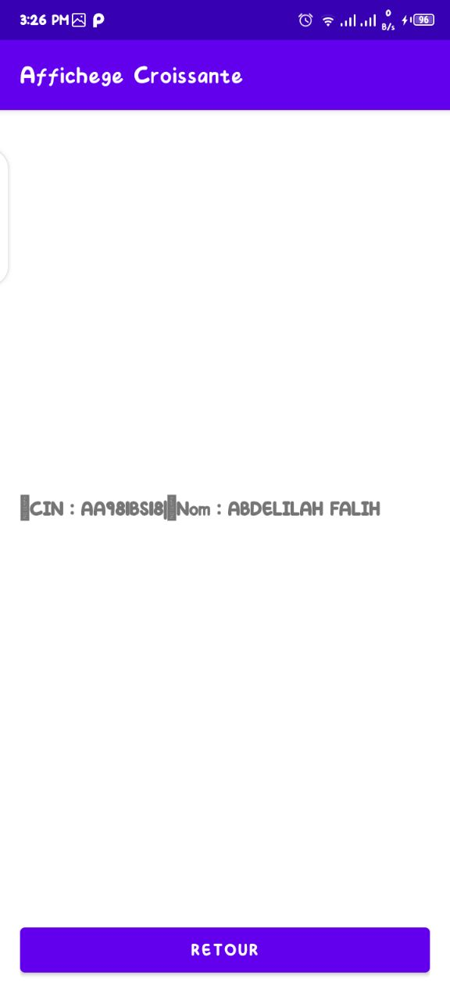

# my-Application

A simple and user-friendly ```Android app ``` for managing daily tasks and activities.

## Features
- [x] Add
- [x] Search By CIN
- [x] Search By Name
- [x] Edit
- [x] Delete By Name
- [x] Delete By CIN
- [x] Display All Ascending
- [x] Display All Descending
- [x] Easy to use interface
- [x] Add, edit and delete tasks

## Screenshots
### Home


---
### All_tasks

---
### Add

---
### search By CIN

---
### Display_all_ascending



## Requirements
- Android 4.4 or higher

## Installation
1. Clone or download the repository
2. Open the project in Android Studio
3. Connect an Android device or start an emulator
4. Run the app on the device or emulator

## Contribution
Feel free to contribute to the development of this app by submitting pull requests.

